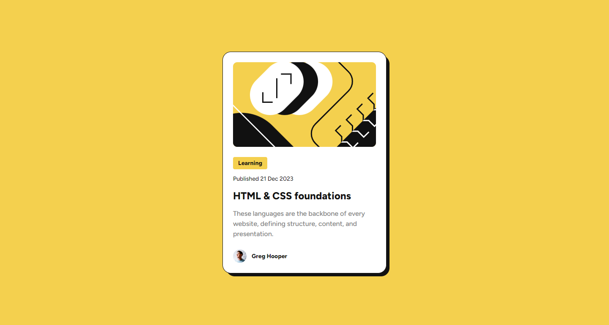
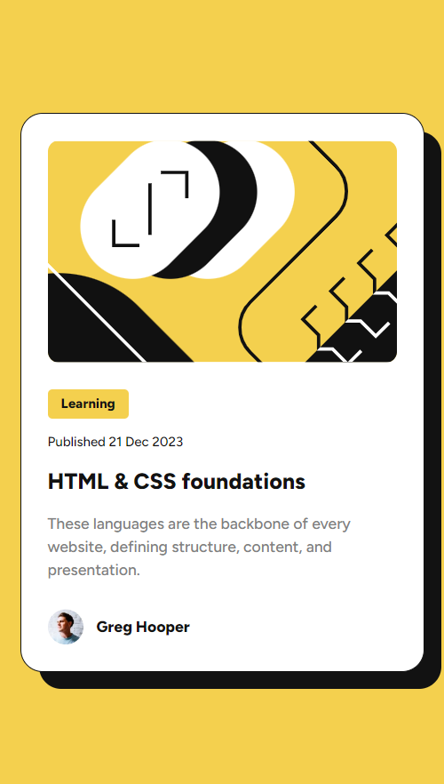

<h1 align="center" style="margin: 0">Blog Preview Card</h1>

Solution to the Frontend Mentor challenge

This is a solution to the <a href="https://www.frontendmentor.io/challenges/blog-preview-card-ckPaj01IcS">Blog Preview Card challenge on Frontend Mentor</a>. Frontend Mentor challenges help you improve your coding skills by building realistic projects.

## Screenshots

### Desktop view

### Mobile view

## Links

- Live Site URL ⇒ https://blog-card-preview-km.netlify.app

## Built with

- HTML5
- CSS

## Features

Users should be able to:

- See hover and focus states for all interactive elements on the page